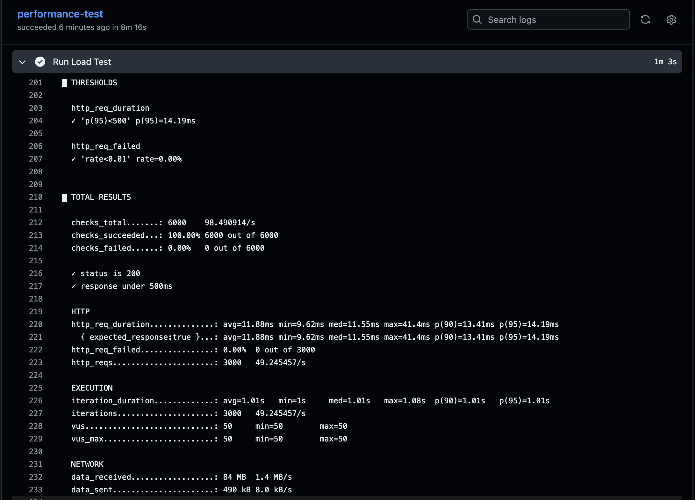

# Performance Test Framework - K6

## Features

- Load Testing using K6
- Stress Testing to find system breaking point
- Spike Testing for sudden traffic bursts
- Mixed User Journey simulation
- Endurance (Soak) Testing
- SLA validation using thresholds

## CI/CD

Performance tests execute automatically using GitHub Actions whenever code is pushed.

Pipeline:

- Installs K6
- Executes all test scenarios
- Validates SLA thresholds
- Ensures no performance regression is introduced


## Load Test Result




## Tech Stack

- K6
- JavaScript
- GitHub Actions

## Project Structure

```
scripts/
loadLogin.js
stressSearch.js
spikeTraffic.js
mixedJourney.js
enduranceTest.js
```
